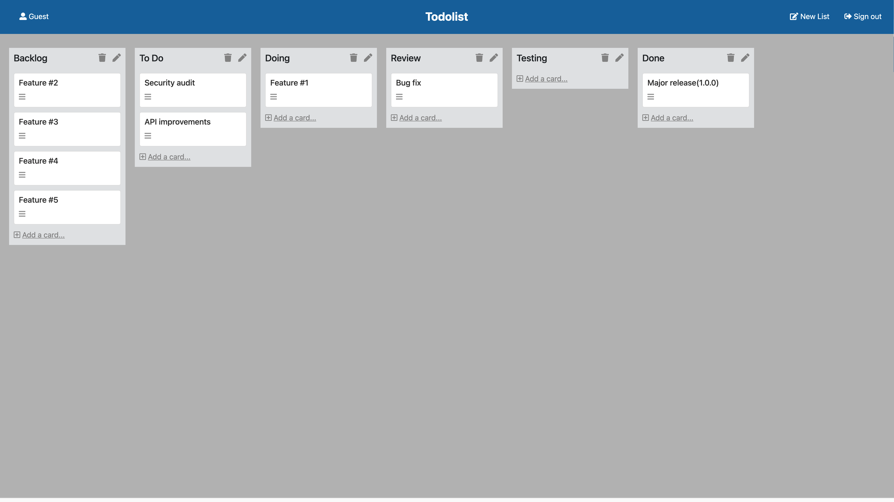
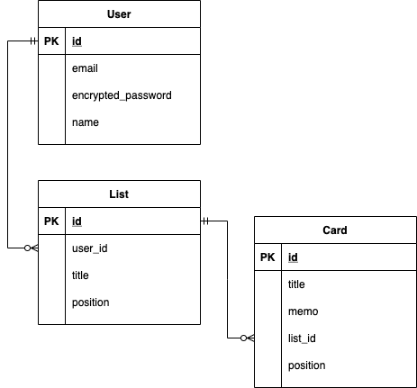

## アプリケーション概要

ToDoリスト管理ツール



## 使用技術

- Ruby 2.6.3
- Ruby on Rails 6.1.4
- MySQL 8.0
- Nginx
- Puma
- Docker

### 品質保証・開発支援ツール

- 静的解析: RuboCop、ERB Lint
- セキュリティチェック: Bundler Audit、Brakeman
- テスト: RSpec（一部Unitテストは Minitest）
- CI: GitHub Actions

## 機能一覧

- ユーザー登録、ログイン機能（devise）
- リスト作成機能
  - 新規作成、更新、削除、並べ替え
- タスクカード作成機能
  - 新規作成、更新、削除、並べ替え

### ER図



### Setup

#### 起動方法

1. Dockerをビルド（初回のみ）

```
$ docker compose build
```

2. コンテナ起動

```
$ docker compose up
```

3. seedを実行

```
$ docker compose exec app bin/rails db:seed
```

4. ブラウザからアクセス

```
http://0.0.0.0:3000
```

#### ゲスト用アカウント

```
Name: Guest
Password: guest#1
```

### Tips

#### Bash

```
$ docker compose exec app bash
```

#### Console

```
$ docker compose exec app bin/rails console
```

#### Testing

- リストとタスクカードの並べ替え機能に関するUnitテスト（Minitest）

```
$ docker compose exec app bin/rails test
```

### 今後の予定

- RSpecを整備
- Railsのバージョンアップ
- CI/CD環境を整備
- ReactによるSPA化
